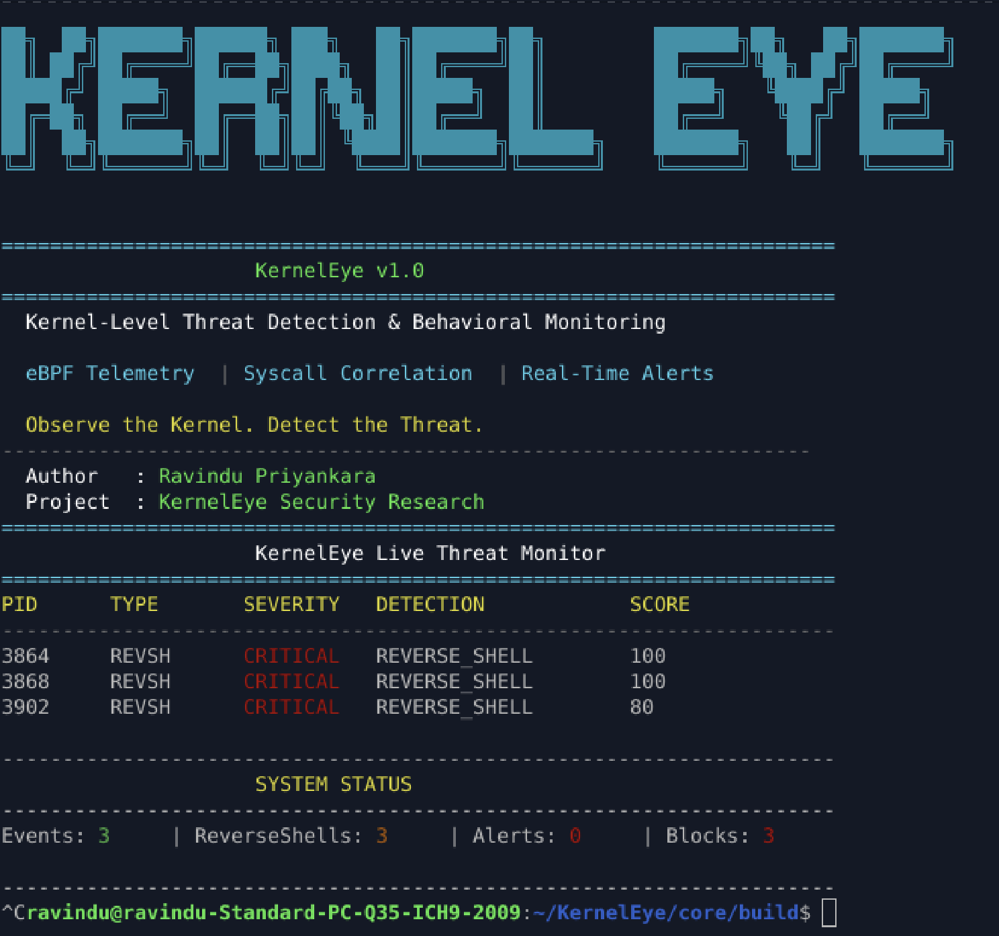
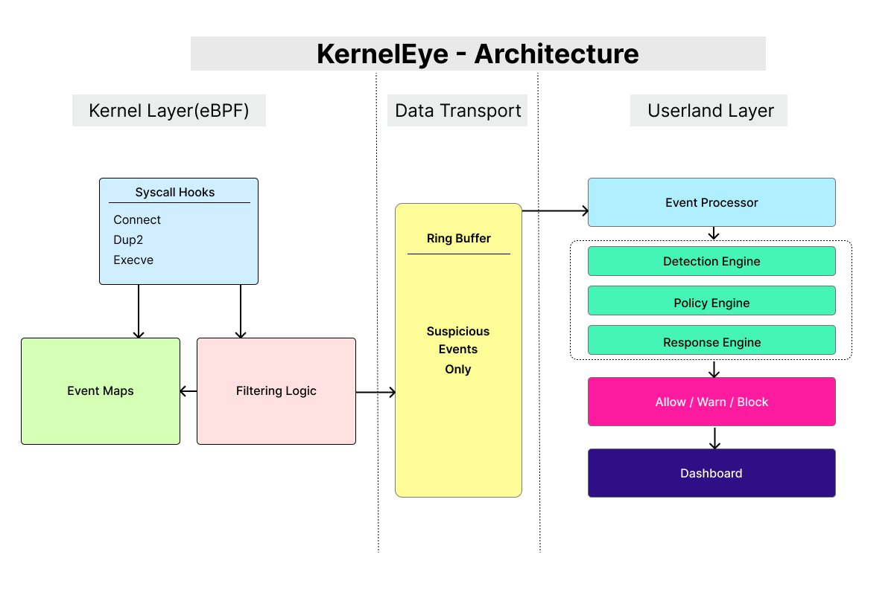

# 🛡️ KernelEye

> **eBPF-based Runtime Security Framework for Linux**  
> Real-time syscall monitoring, behavior correlation, and active threat response.

---



## 🚀 Overview

KernelEye is a modular runtime security system built using **eBPF** and **C**, designed to detect and respond to suspicious process behavior in real time.

It monitors low-level system activity (syscalls), correlates events inside the kernel, and performs detection, policy evaluation, and response in userland.

---

## ⚡ Core Capabilities

- 🔹 **Syscall Monitoring (eBPF)**
  - Tracks `connect`, `dup2`, and `execve` syscalls
  - Captures process and network behavior at runtime

- 🔹 **Kernel-Level Correlation**
  - Combines multiple syscalls into meaningful behavioral patterns
  - Efficient filtering before sending data to userland

- 🔹 **Detection Engine (Modular)**
  - Plugin-style detector architecture
  - Current implementation: reverse shell detection

- 🔹 **Policy Engine**
  - Separates detection from decision-making
  - Score + severity based evaluation

- 🔹 **Response Engine**
  - Alert, allow, or actively block malicious processes
  - Process termination via signal-based response

- 🔹 **Real-Time Monitoring UI**
  - Live event display
  - Detection statistics and summaries

---

## ⚡ Detection Example

KernelEye detects reverse shells using **multi-signal correlation**:

```text
connect → dup2 → execve
        + timing correlation
        + descriptor tracking
        + filename analysis
````

Instead of relying on single indicators, it uses:

* behavioral patterns
* syscall ordering
* timing windows
* rule-based scoring

---

## ⚡ Architecture



---

## 📚 Documentation

👉 Full documentation: see [docs](./docs/README.md)

### Quick Links

* [Demo](./DEMO.md) — example usage and workflow
* [Installation](./INSTALL.md) — setup instructions

### Suggested Reading Path

```text
Project Description
    ↓
System Overview
    ↓
Data Flow
    ↓
Kernel Layer
    ↓
Userland Layer
    ↓
Detection → Policy → Response
```

---

## ⚡ Project Structure

```text
core/
├── bpf/           # eBPF programs
├── probes/        # syscall trackers
├── maps/          # kernel storage
├── detections/    # detection logic
├── policies/      # decision layer
├── responses/     # action layer
├── events/        # event handling
├── loader/        # eBPF loader
└── ui/            # display layer

docs/
├── 01_Overview/
└── 02_Architecture/
```

---

## ⚡ Tech Stack

* **eBPF** — kernel-level instrumentation
* **C (libbpf)** — userland processing
* **Linux Kernel** — syscall tracing & hooks

---

## ⚡ Design Principles

* **Kernel/Userland separation**
* **Minimal kernel overhead**
* **Event correlation over raw logging**
* **Modular detection architecture**
* **Policy-driven response system**

---

## ⚠️ Current Limitations

* Limited syscall coverage (`connect`, `dup2`, `execve`)
* No process tree (PPID chain) tracking yet
* Static policy thresholds
* Basic UI (actively evolving)

---

## ⚡ Roadmap

* PPID / process tree tracking
* Support for `dup3`, `fcntl`
* Advanced correlation logic
* External alert integrations
* Web-based dashboard
* Performance optimizations (event dispatch filtering)

---

## ⚡ Example Use Cases

* Reverse shell detection
* Suspicious process monitoring
* Runtime behavior analysis
* Lightweight host intrusion detection

---

## 👨‍💻 Author

**Ravindu Priyankara**

---

## ⚡ Final Note

KernelEye is built with a focus on **understanding behavior, not just events**.

> It is not a log collector.
> It is a **runtime decision system**.

