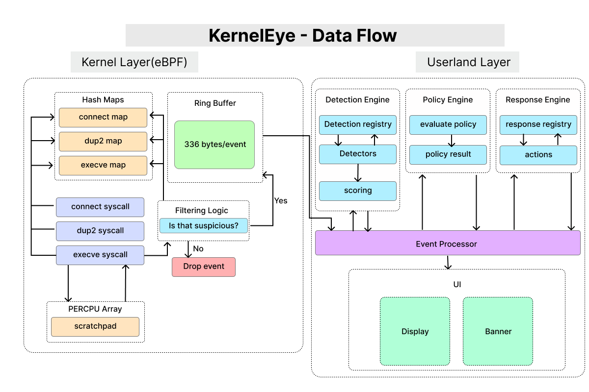

# Kernel Eye — Data Flow

> This document explains the end-to-end flow of events in Kernel Eye, from kernel-level syscall monitoring to userland detection, policy evaluation, and response.  
> The accompanying diagram shows how each component interacts and how data moves through the system.

---

## 1. Overview

Kernel Eye captures critical syscalls (`connect`, `dup2`, `execve`) at the kernel level using eBPF, correlates them via **hash maps** and **per-CPU scratchpads**, and delivers **validated events** to the userland for detection and response.  

The flow ensures **high performance** (~500k syscalls/sec), **minimal noise**, and **policy-driven action**.

---

## 2. Kernel Layer (eBPF)

**Responsibilities:**

- Hooks key syscalls:
  - `connect` → network activity
  - `dup2` → file descriptor redirection
  - `execve` → process execution
- Stores event metadata in hash maps:
  - **Connect Map**
  - **Dup2 Map**
  - **Execve Map**
- Uses **per-CPU scratchpad arrays** for temporary storage (e.g., filename buffers) to avoid stack overflows
- Applies **filtering logic**:
  - `Is this suspicious?` → only suspicious events are pushed to the ring buffer
  - Non-suspicious events are dropped
<!-- Handles **forked processes** via PPID tracking-->

---

## 3. Ring Buffer

- Acts as the **bridge between kernel and userland**
- Kernel writes only **validated events** (≈336 bytes/event)
- Userland polls/consumes events efficiently
- Prevents event flooding in high-throughput environments

---

## 4. Userland Layer

**Event Processor:**  
- Reads events from ring buffer
- Prepares them for detection

**Detection Engine:**  
- Evaluates events against detection rules
- Detection Registry manages available detectors
- Examples:
  - Reverse shell detector
  <!--- Syscall anomaly detectors-->

**Policy Engine:**  
- Evaluates detection results
- Determines which **response action** should be taken
- Outputs scoring and policy decisions

**Response Engine:**  
- Executes actions based on policy:
  - Allow
  - Block
  - Alert
- Maintains **Response Registry** for structured management

**UI Layer:**  
- Displays events and results
- Banner, display buffers, dashboards

---

## 5. Event Lifecycle (Step by Step)

1. Syscall occurs in kernel (`connect`, `dup2`, `execve`)
2. Kernel Layer captures the event → stores in hash maps + scratchpad
3. Filtering logic:
   - Suspicious → push to ring buffer
   - Non-suspicious → drop
4. Userland Event Processor reads ring buffer
5. Detection Engine evaluates rules → Detection Registry / Detectors
6. Policy Engine decides action → scoring, policy result
7. Response Engine executes → updates UI/Dashboard

---

## 6. Design Highlights

- **High-performance:** kernel-level filtering + per-CPU buffers  
- **Signal over noise:** only validated events reach userland  
- **Modular detection:** detection registry makes it easy to add detectors  
- **Policy-driven response:** separation of detection and action  
- **Scalable & maintainable:** clear layers + registries for each component

---

This document and diagram together provide a **clear, technical understanding** of how Kernel Eye processes, correlates, and reacts to system events.