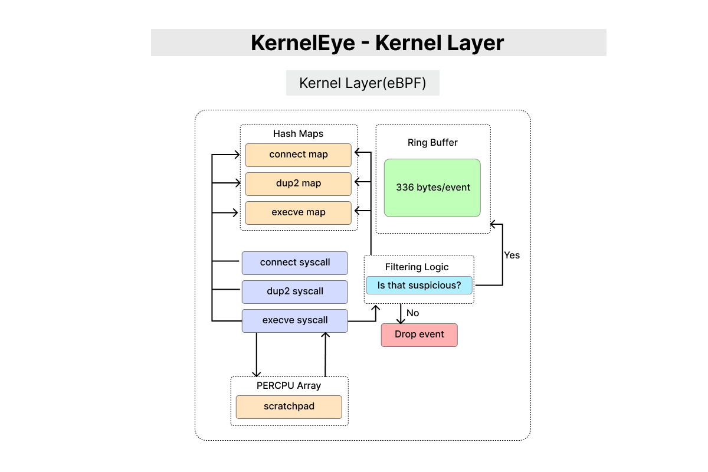

# KernelEye - Kernel Layer Overview

> This document provides a high-level overview of the Kernel Layer in Kernel Eye.  
> It explains the role of eBPF programs, syscall monitoring, and in-kernel event processing.

---

## 1. Purpose

The Kernel Layer is responsible for **capturing, filtering, and correlating system events** at the lowest level using eBPF.

It operates directly inside the Linux kernel, allowing Kernel Eye to:
- Observe real system behavior
- Minimize overhead
- Avoid reliance on user-space logging

---

## 2. Core Responsibilities

### • Syscall Monitoring
The Kernel Layer attaches eBPF programs to critical syscalls:

- `connect` → network activity  
- `dup2` → file descriptor redirection  
- `execve` → process execution  

These syscalls form the foundation for behavior-based detection.

---

### • Event Capture & Temporary Storage

- Uses **per-CPU scratchpad arrays** to safely handle temporary data (e.g., `filename[255]`)
- Avoids eBPF stack limitations and verifier issues
- Ensures safe and efficient memory usage

---

### • State Management via Maps

Kernel Eye uses multiple eBPF hash maps to store partial syscall state:

- **Connect Map** → network metadata  
- **Dup2 Map** → file descriptor relationships  
- **Execve Map** → execution context  
<!-- **PPID Tracking** → parent-child process relationships  -->

These maps enable **cross-syscall correlation**.

---

### • Correlation Logic

The Kernel Layer performs **initial behavior correlation** using stored syscall data.

Example (reverse shell pattern):
- connect → dup2 (fd ≥ 2) → execve

This allows the system to detect suspicious execution flows at the kernel level.

---

### • Kernel-Side Filtering

A key design principle is:
> **Filter early, send only meaningful data**

- Suspicious events → sent to ring buffer  
- Non-suspicious events → dropped  

This reduces noise and avoids overwhelming userland.

---

### • Event Output

- Uses a **ring buffer** to send events to userland
- Each event ≈ 336 bytes
- Optimized for **low-frequency, high-signal delivery**

---

## 3. Design Principles

- **Performance-first**: minimal overhead in high syscall environments  
- **Safe memory usage**: avoids stack overflow via per-CPU buffers  
- **Behavior-based detection**: focuses on syscall relationships, not isolated events  
- **Kernel-side filtering**: reduces unnecessary data transfer  

---

## 4. Scope

This document provides a high-level view of the Kernel Layer.  
Detailed explanations are covered in the following documents:

- Probes (`connect`, `dup2`, `execve`)
- Map design and lifecycle
- Scratchpad memory usage
- Correlation logic
- Filtering strategy
- Event output (ring buffer)

---