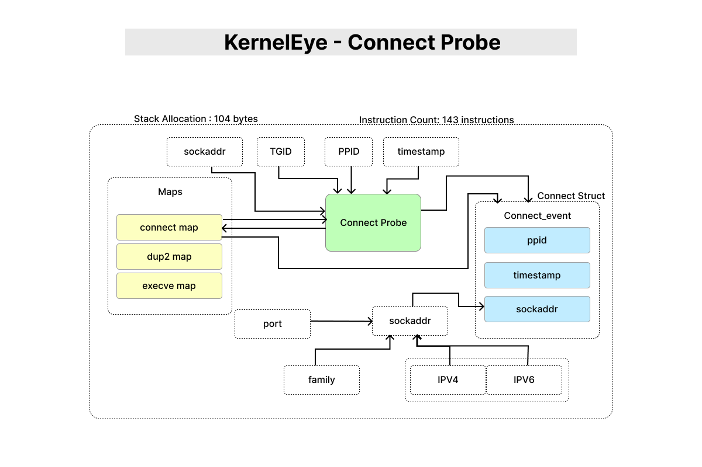

# KernelEye - Connect Probe

> This document describes the `connect` syscall probe used in Kernel Eye.  
> It captures outbound network connection attempts and stores structured data for later correlation and detection.



---

## 1. Purpose

The connect probe monitors the `connect` syscall to track **outbound network activity** initiated by user processes.

This information is essential for detecting behaviors such as:
- Reverse shells
- Unauthorized outbound connections
- Suspicious network patterns

---

## 2. Tracepoint Hook

```c
SEC("tracepoint/syscalls/sys_enter_connect")
````

This probe is attached to the `sys_enter_connect` tracepoint, which triggers whenever a process invokes the `connect` syscall.

---

## 3. Data Captured

The probe extracts and stores:

* Process ID (`pid`)
* Parent Process ID (`ppid`)
* Timestamp (`net_ts`)
* IP address (IPv4 / IPv6)
* Port number
* Address family

---

## 4. Execution Flow

1. Validate input pointer (`ctx->args[1]`)
2. Read `struct sockaddr` safely using `bpf_probe_read_user`
3. Determine socket family (IPv4 / IPv6)
4. Parse address and port into structured event
5. Retrieve:

   * PID (`get_tgid`)
   * PPID (`get_ppid`)
   * Timestamp (`get_trigger_time`)
6. Sanitize PID and PPID
7. Store event in `connect_map`

---

## 5. Map Interaction

* **Map Used:** `connect_map`
* **Key:** `pid`
* **Value:** `struct connect_event`

### Notes:

* Stores latest connection state per process
* Used later for syscall correlation (`dup2`, `execve`)
* Current implementation uses `BPF_ANY`

  * Does not overwrite existing entries by design

---

## 6. Stack Usage & Memory Layout

###  Verifier-Observed Stack Usage

* **Maximum stack depth:** 104 bytes
* **Limit:** 512 bytes →  Safe

---

### Stack Layout (r10 frame pointer)

```
r10 (top of stack)
│
│  -0     : scratch
│  -8     : sin6_port
│  -16    : sin6_addr (part)
│  -24    : sin6_addr / sin overlap
│  -32    : sockaddr overlap / temp
│  -36    : ppid temp
│  -48    : sockaddr
│  -56    : sockaddr (rest)
│  -60    : event.port
│  -64    : event (ipv6 part)
│  -68    : event (ipv6 part)
│  -72    : event (shared)
│  -76    : event (ipv4 part)
│  -80    : event.family
│  -88    : event.net_ts
│  -96    : event.ppid
│  -100   : pid temp
```

---

### Design Notes

* IPv4 and IPv6 structures overlap in memory to reduce stack usage
* All memory writes are aligned and verifier-safe
* Larger data structures are avoided on stack
* Per-CPU maps are preferred for large buffers

---

## 7. Instruction Count

* **Total instructions:** 143
* **Program size:** 1144 bytes

### Notes:

* Within safe limits for eBPF programs
* Optimized to avoid unnecessary branching and complexity

---

## 8. Address Parsing Logic

The probe uses helper functions:

* `get_socket_family()` → determines IPv4 / IPv6
* `parse_socket_address()` → extracts IP and port

### Why this matters:

* eBPF cannot directly trust user pointers
* Safe parsing ensures correctness and verifier compliance

---

## 9. Data Validation

Before storing:

* `sanitize_the_pid(pid)`
* `sanitize_the_pid(ppid)`

### Purpose:

* Ignore kernel threads
* Avoid tracking invalid or idle processes

---

## 10. Design Considerations

* **Safety-first:** all user memory reads validated
* **Verifier-aware:** strict stack and alignment discipline
* **Efficient storage:** minimal per-event footprint
* **Correlation-ready:** data structured for later detection

---

## 11. Role in Detection Pipeline

This probe provides the **network initiation signal** for behavior detection.

Example usage in reverse shell detection:

```
connect → dup2 → execve
```

Without this probe, outbound connection context would be missing.

---

This probe is a critical component in Kernel Eye’s ability to detect network-driven attack behaviors with minimal overhead.
