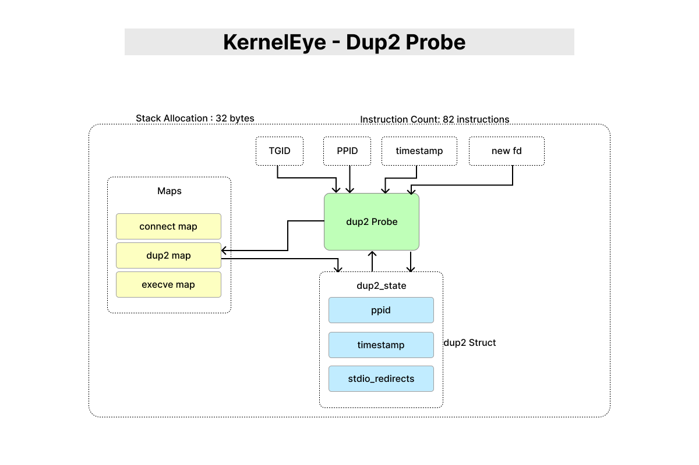

# KernelEye - Dup2 Probe

> This document describes the `dup2` syscall probe used in Kernel Eye.  
> It tracks file descriptor redirection behavior, which is a critical signal in detecting interactive shells such as reverse shells.



---

## 1. Purpose

The dup2 probe monitors the `dup2` syscall to detect **file descriptor redirection**, particularly involving standard input/output streams.

This behavior is commonly observed in:
- Reverse shells
- Remote command execution setups
- Interactive process control over network sockets

---

## 2. Tracepoint Hook

```c
SEC("tracepoint/syscalls/sys_enter_dup2")
````

This probe triggers whenever a process invokes the `dup2` syscall.

---

## 3. Data Captured

The probe records:

* Process ID (`pid`)
* Parent Process ID (`ppid`)
* Timestamp (`last_dup2_ts`)
* Number of stdio redirections (`stdio_redirects`)

---

## 4. Execution Flow

1. Retrieve:

   * PID (`get_tgid`)
   * PPID (`get_ppid`)
   * Timestamp (`get_trigger_time`)
2. Extract new file descriptor (`fd_new`)
3. Filter:

   * Only track `fd <= 2` (stdin, stdout, stderr)
4. Sanitize PID and PPID
5. Check if state exists in `dup2_map`

   * If exists → update existing state
   * If not → create new state
6. Store/update state in `dup2_map`

---

## 5. File Descriptor Filtering

```c
if(fd_new > 2) return 0;
```

### Why?

* Only `0`, `1`, `2` (stdin, stdout, stderr) are relevant for shell interaction
* Prevents noise from unrelated file descriptor operations
* Focuses detection on meaningful redirection behavior

---

## 6. Map Interaction

* **Map Used:** `dup2_map`
* **Key:** `pid`
* **Value:** `struct dup2_state`

### Structure Fields:

* `ppid` → parent process
* `last_dup2_ts` → last redirection timestamp
* `stdio_redirects` → number of redirections

---

### Update Strategy

```c
event = check_map_data_availability(&dup2_map, &pid);
```

* If entry exists:

  * Update timestamp
  * Increment redirect count
* If not:

  * Create new state

### Why this matters:

* Avoids resetting state on repeated syscalls
* Allows tracking **multiple redirections over time**
* Enables stronger behavioral correlation

---

## 7. Stack Usage & Memory Layout

### Verifier-Observed Stack Usage

* **Maximum stack depth:** 32 bytes
* **Limit:** 512 bytes → Safe

---

### Stack Layout (r10 frame pointer)

```id="qv0u2x"
r10 (top of stack)
│
│  -0     : scratch
│  -4     : ppid
│  -8     : pid
│  -12    : stdio_redirects (aligned)
│  -16    : dup2_state.ppid
│  -24    : dup2_state.last_dup2_ts
```

---

### Design Notes

* Very low stack usage → efficient and verifier-friendly
* 1-byte field (`stdio_redirects`) aligned by verifier
* Minimal memory footprint per event

---

## 8. Instruction Count

* **Total instructions:** 82
* **Program size:** 656 bytes

### Notes:

* Lightweight compared to other probes
* Optimized for high-frequency syscall environments

---

## 9. Data Validation

* `sanitize_the_pid(pid)`
* `sanitize_the_pid(ppid)`

### Purpose:

* Ignore kernel threads
* Avoid invalid or idle processes

---

## 10. Behavioral Role in Detection

This probe is critical for identifying **interactive session behavior**.

### Example (reverse shell pattern):

```id="a0h1rz"
connect → dup2 → execve
```

### Interpretation:

* `connect` → establishes remote connection
* `dup2` → redirects stdio to socket
* `execve` → spawns shell

---

## 11. Detection Signal Strength

* A single `dup2` call is weak signal
* Multiple redirects (`stdio_redirects++`) increase confidence

### Insight:

> The more stdio redirections observed, the higher the likelihood of an interactive shell.

---

## 12. Design Considerations

* **Noise reduction:** tracks only stdio descriptors
* **Stateful tracking:** accumulates behavior over time
* **Efficient updates:** avoids unnecessary allocations
* **Correlation-ready:** integrates with connect + execve

---


This probe provides the **interaction signal** required to elevate network activity into confirmed shell behavior.
