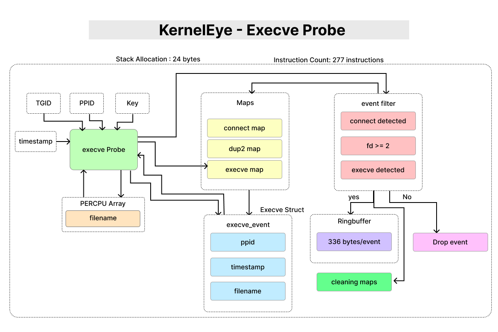

# KernelEye - Execve Probe

> This document describes the `execve` syscall probe used in Kernel Eye.  
> It acts as the final trigger point for behavior-based detection by correlating execution with prior network and descriptor activity.



---

## 1. Purpose

The execve probe monitors process execution and serves as the **final stage in detection**, where previously collected syscall data is validated and converted into actionable events.

This probe is responsible for:
- Capturing execution context
- Completing syscall correlation
- Triggering detection logic
- Emitting structured alerts to userland

---

## 2. Tracepoint Hook

```c
SEC("tracepoint/syscalls/sys_enter_execve")
````

This probe triggers whenever a process invokes the `execve` syscall.

---

## 3. Data Captured

* Process ID (`pid`)
* Parent Process ID (`ppid`)
* Execution timestamp (`execve_ts`)
* Executed filename (`filename`)

---

## 4. Execution Flow

1. Retrieve:

   * PID (`get_tgid`)
   * PPID (`get_ppid`)
   * Timestamp (`get_trigger_time`)
2. Sanitize PID and PPID
3. Access per-CPU scratchpad (`tmp_execve_map`)
4. Copy filename safely from user memory
5. Assign metadata (`ppid`, `execve_ts`)
6. Store in `execve_hash_map` (persistent storage)
7. Perform detection check (`is_reverse_shell`)
8. If detected:

   * Build event
   * Send to ring buffer
   * Clean up maps

---

## 5. Scratchpad Usage (Per-CPU Map)

* **Map Used:** `tmp_execve_map` (PERCPU ARRAY)
* Used as temporary storage for `struct execve_event`

### Why?

* Avoids large stack allocations (`filename[256]`)
* Prevents verifier rejection due to stack limits
* Provides safe, reusable buffer per CPU

---

## 6. Filename Extraction

```c id="xq2r7n"
bpf_probe_read_user_str(tmp_event->filename, sizeof(tmp_event->filename), (void *)ctx->args[0]);
```

### Edge Case Handling

* If read fails:

  * `filename[0] = 0` (mark as unknown)

### Bug Fix Insight

Previous issue:

* NULL `argv/envp` caused silent failures
* Events were skipped due to map logic

Fix:

* Always write event
* Handle NULL safely
* Use forced map update

---

## 7. Map Interaction

### Maps Used:

* `tmp_execve_map` → temporary scratchpad
* `execve_hash_map` → persistent execution data
* `connect_map` → network context
* `dup2_map` → descriptor state

### Update Strategy

```c id="k9f4wm"
force_update_map_element(&execve_hash_map, &pid, tmp_event, BPF_ANY)
```

* Ensures latest execution is always recorded
* Avoids stale or missing data

---

## 8. Stack Usage & Memory Layout

### Verifier-Observed Stack Usage

* **Maximum stack depth:** 24 bytes
* **Limit:** 512 bytes → Safe

---

### Stack Layout (r10 frame pointer)

```id="t9e2zz"
r10 (top of stack)
│
│  -0     : scratch
│  -8     : parent task pointer
│  -12    : ppid (helper)
│  -16    : pid
│  -20    : key
```

---

### Design Notes

* Very low stack usage
* Large data handled via per-CPU maps instead of stack
* Verifier-friendly layout

---

## 9. Instruction Count

* **Total instructions:** 277
* **Program size:** 2216 bytes

### Notes:

* Higher than other probes due to:

  * filename handling
  * detection logic
  * ring buffer emission

---

## 10. Detection Logic (Core)

The execve probe triggers detection via:

```c id="v8d2mp"
if(!is_reverse_shell(pid)) return 0;
```

---

### Reverse Shell Conditions

```id="q3j8sx"
connect + dup2 + execve
```

* `connect` → network connection established
* `dup2` → stdio redirected (>= 2)
* `execve` → process execution

---

### Detection Function

* Validates existence of:

  * connect event
  * dup2 state
  * execve event
* Confirms:

  * `stdio_redirects >= 2`

---

## 11. Event Generation & Ring Buffer

If detection is successful:

```c id="d3p2zn"
ke_reverse_shell_type_event(pid)
```

### Steps:

1. Extract correlated data from maps
2. Reserve ring buffer space
3. Populate structured event:

   * PID, PPID, timestamps
   * filename
   * network address
   * descriptor count
4. Submit event to userland

---

## 12. Map Cleanup

After emitting event:

* `connect_map` → delete
* `execve_hash_map` → delete
* `dup2_map` → delete

### Purpose:

* Prevent duplicate detections
* Free map space
* Maintain clean state


## 13. Design Considerations

* **Final-stage detection:** all signals converge here
* **Kernel-side decision making:** avoids unnecessary userland load
* **Efficient memory usage:** scratchpad + maps
* **Robust handling:** safe reads + edge case fixes
* **Correlation-driven:** not event-based, but behavior-based

---

## 14. Role in Detection Pipeline

This probe is the **execution trigger** that completes the detection chain:

```id="f1v9lx"
connect → dup2 → execve → detection → ring buffer
```

Without this stage, earlier signals cannot be validated as a real attack.

---

This probe transforms collected syscall signals into **confirmed behavioral detections**, making it the core of Kernel Eye’s runtime security logic.
