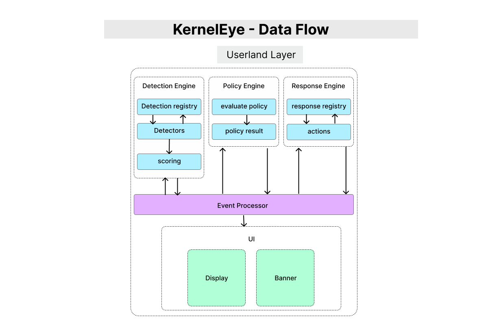

# KernelEye - Userland Architecture Overview

> This document provides a high-level overview of the Userland Layer in Kernel Eye.  
> It describes how events from the kernel are processed, analyzed, and transformed into actionable responses.



---

## 1. Purpose

The Userland Layer is responsible for **processing, evaluating, and responding to events** generated by the Kernel Layer.

While the kernel performs:
- syscall capture  
- correlation  
- filtering  

The userland handles:
- event processing  
- detection refinement  
- policy decisions  
- response execution  
- visualization  

---

## 2. High-Level Flow

``` id="ulflow1"
Ring Buffer
    ↓
Event Processor
    ↓
Detection Engine
    ↓
Policy Engine
    ↓
Response Engine
    ↓
UI / Logs
````

---

## 3. Core Responsibilities

### • Event Consumption

* Reads events from the ring buffer
* Parses structured data (`ke_suspicious_event`)
* Converts raw data into usable internal format

---

### • Detection Processing

* Evaluates incoming events
* Applies detection logic and scoring
* Uses a **Detection Registry** to manage detectors

---

### • Policy Evaluation

* Determines severity of detected events
* Maps detections to actions
* Produces a policy decision

---

### • Response Execution

* Executes actions based on policy:

  * Alert
  * Log
  * Block
* Uses a **Response Registry** for modular actions

---

### • Visualization (UI Layer)

* Displays events in a structured format
* Provides real-time feedback
* Supports CLI output and dashboards

---

## 4. Design Principles

### • Separation of Concerns

Each component has a clear responsibility:

* Detection → identifies behavior
* Policy → decides what to do
* Response → executes action

---

### • Modular Architecture

* Components are independent
* Easy to extend:

  * add detectors
  * add policies
  * add responses

---

### • Event-Driven Pipeline

* System reacts to incoming events
* No polling or scanning logic
* Efficient and scalable

---

### • Kernel-Offloaded Intelligence

* Kernel performs heavy filtering
* Userland receives only high-value events
* Reduces processing overhead

---

## 5. Component Overview

### Event Processor

* Entry point for all kernel events
* Responsible for parsing and forwarding data

---

### Detection Engine

* Core analysis layer
* Uses detectors to evaluate events

---

### Policy Engine

* Decision-making layer
* Assigns severity and selects actions

---

### Response Engine

* Executes actions
* Handles alerts, logging, and enforcement

---

### UI Layer

* Displays processed events
* Provides visibility into system behavior

---

## 6. Interaction with Kernel Layer

```id="ulflow2"
Kernel Layer
    ↓ (ring buffer)
Userland Event Processor
```

* Kernel sends only validated events
* Userland operates on structured, filtered data
* Clear boundary between detection (kernel) and reaction (userland)

---

## 7. Extensibility

The architecture supports future expansion:

* New detectors (behavioral, anomaly-based)
* Advanced policy rules (scoring systems)
* Additional response types (network block)
* External integrations (SIEM, logging systems)

---

## 8. Scope

This document provides a high-level overview of the Userland Layer.
Detailed explanations are covered in:

* Event Processor
* Detection Engine
* Policy Engine
* Response Engine
* UI Layer

---

## 9. Summary

The Userland Layer transforms:

```id="ulflow3"
kernel events → analysis → decision → action → visibility
```

By separating detection, decision-making, and response, Kernel Eye achieves a **clean, scalable, and extensible security architecture**.
