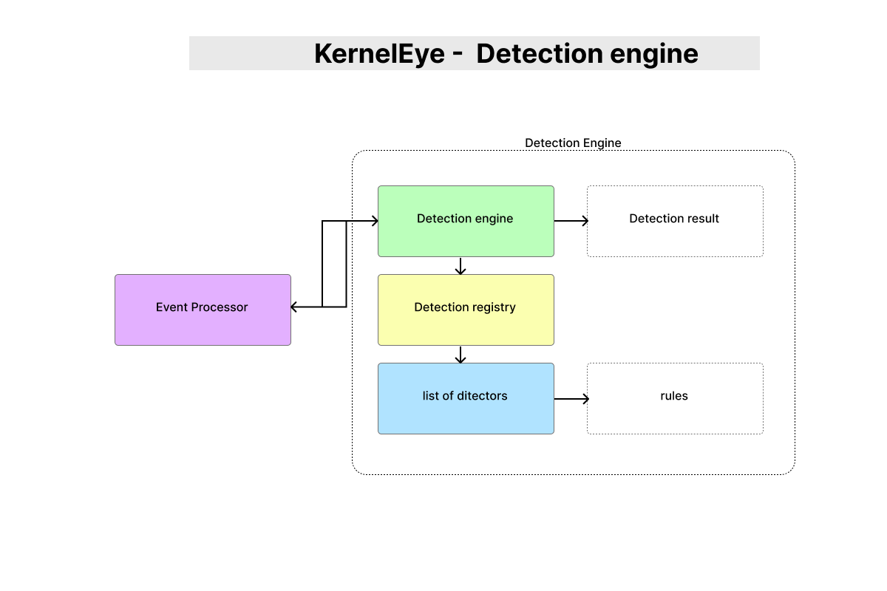

# KernelEye - Detection Engine Overview

> This document describes the Detection Engine in Kernel Eye.  
> It is responsible for analyzing incoming events and determining whether they represent suspicious or malicious behavior.

---



## 1. Purpose

The Detection Engine evaluates structured events received from the Event Processor and determines:

- Whether the event matches known detection patterns  
- What type of detection it represents  
- The severity and score of the detection  

---

## 2. High-Level Flow

``` id="deflow1"
Event Processor
    ↓
run_detections()
    ↓
Detector Registry
    ↓
Matching Detector
    ↓
Detection Result
````

---

## 3. Core Function

```c id="de_core"
int run_detections(
    struct ke_suspicious_event *event,
    struct ke_detection_result *result
);
```

---

### Responsibilities:

* Iterate through all registered detectors
* Pass event data to each detector
* Stop execution when a match is found
* Populate `ke_detection_result`

---

## 4. Detection Execution Model

```c id="de_loop"
for(int i = 0; i < detector_count; i++){
    if(detectors[i].detect(event, result))
        return 1;
}
```

---

### Behavior:

* Each detector decides:

  * “Is this my event?”
* First successful match:

  * stops further processing
* Returns:

  * `1` → detection successful
  * `0` → no match

---

## 5. Detector Registry

The Detection Engine uses a **registry-based design**.

```c id="de_registry"
ke_detector detectors[] = {
    {.name = "reverse_shell", .detect = detect_reverse_shell}
};
```

---

### Features:

* Centralized detector list
* Easy to extend
* Plug-and-play architecture

---

### Detector Count

```c id="de_count"
int detector_count = sizeof(detectors) / sizeof(detectors[0]);
```

---

## 6. Detector Interface

Each detector follows a standard interface:

```c id="de_interface"
int detect(struct ke_suspicious_event *event,
           struct ke_detection_result *result);
```

---

### Responsibilities of a Detector:

* Inspect event data
* Decide if it matches a pattern
* Populate detection result
* Return:

  * `1` → match
  * `0` → not applicable

---

## 7. Detection Result Structure

```c id="de_result"
struct ke_detection_result {
    int detection_id;
    int score;
    int severity;
    bool detected;
};
```

---

### Fields:

* `detection_id` → type of detection
* `score` → confidence / weight
* `severity` → impact level
* `detected` → boolean flag

---

## 8. Detection Types

```c id="de_types"
enum ke_detection_id {
    KE_DET_CONNECT_WITH_EXECVE = 0,
    KE_DET_REVERSE_SHELL,
};
```

---

## 9. Severity Levels

```c id="de_severity"
enum ke_severity {
    KE_SEV_INFO = 1,
    KE_SEV_WARNING,
    KE_SEV_CRITICAL
};
```

---

### Interpretation:

* INFO → low-risk activity
* WARNING → suspicious behavior
* CRITICAL → confirmed malicious activity

---

## 10. Example Detection Flow

```id="deflow2"
Incoming Event (reverse shell)
        ↓
Detection Engine loop
        ↓
reverse_shell detector matches
        ↓
result populated:
    detection_id = KE_DET_REVERSE_SHELL
    severity = CRITICAL
        ↓
return to Event Processor
```

---

## 11. Design Characteristics

### • Modular

* New detectors can be added easily
* No changes required in core engine

---

### • Extensible

Supports future detectors:

* anomaly detection
* behavioral rules
* signature-based detection

---

### • Efficient (Current Model)

* Stops at first match
* Avoids unnecessary processing

---

## 12. Limitations

### Current Design:

* Iterates through all detectors
* No event-type filtering before execution
* Single-match model (no multi-detection support)

---

## 13. Future Improvements

### Planned Enhancements:

* Event-type pre-filtering (dispatch only relevant detectors)
* Multi-detector execution (support multiple matches)
* Detection scoring aggregation
* Parallel execution (multi-threading)
* Priority-based detector ordering

---

## 14. Design Philosophy

> **Detection logic should be modular, independent, and easy to extend.**

The Detection Engine ensures:

* clean separation from policy decisions
* reusable detection components
* scalable architecture

---

## 15. Role in System

```id="deflow3"
event → detection → result → policy → response
```

The Detection Engine is responsible for:

* converting raw events into meaningful detections
* acting as the **analysis layer** of the system

---

## 16. Summary

The Detection Engine transforms:

```id="deflow4"
structured events → detection results
```

By using a registry-based design, Kernel Eye achieves:

* flexibility
* scalability
* maintainability
