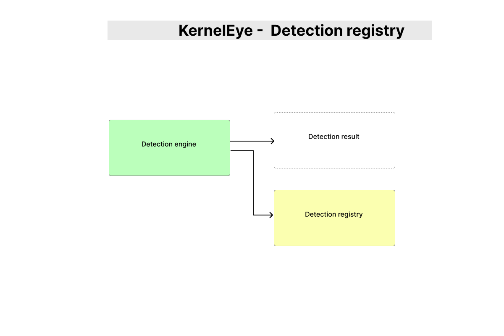

# KernelEye - Detection Registry

> This document describes the Detection Registry in Kernel Eye.  
> It defines how detectors are registered, managed, and executed by the Detection Engine.

---



## 1. Overview

The Detection Registry is a centralized list of all available detectors in the system.

It enables:

- modular detection logic  
- easy extension of new detectors  
- clean separation between detection engine and detection implementations  

---

## 2. Purpose

Instead of hardcoding detection logic inside the engine, Kernel Eye uses a **registry-based approach**:

> Detection Engine → iterates over registered detectors → executes matching logic

---

## 3. Registry Definition

```c id="dr_registry"
ke_detector detectors[] = {
    {.name = "reverse_shell", .detect = detect_reverse_shell}
};
````

---

## 4. Detector Structure

Each detector is defined as:

```c id="dr_struct"
typedef struct {
    const char *name;
    int (*detect)(struct ke_suspicious_event *, struct ke_detection_result *);
} ke_detector;
```

---

### Fields:

* `name` → identifier of detector
* `detect` → function pointer to detection logic

---

## 5. Detector Count

```c id="dr_count"
int detector_count = sizeof(detectors) / sizeof(detectors[0]);
```

---

### Purpose:

* Enables iteration over registry
* Automatically adjusts when new detectors are added

---

## 6. External Detector Linking

Detectors are implemented separately and linked via `extern`.

```c id="dr_extern"
extern int detect_reverse_shell(
    struct ke_suspicious_event *event,
    struct ke_detection_result *result
);
```

---

### Benefits:

* clean separation of implementation
* modular development
* independent testing of detectors

---

## 7. Execution Flow

```id="dr_flow"
Detection Engine
    ↓
iterate detectors[]
    ↓
call detect()
    ↓
match → return result
```

---

## 8. Adding a New Detector

### Step 1 — Implement detector

```c id="dr_new1"
int detect_new_pattern(struct ke_suspicious_event *event,
                       struct ke_detection_result *result);
```

---

### Step 2 — Declare extern

```c id="dr_new2"
extern int detect_new_pattern(...);
```

---

### Step 3 — Register in registry

```c id="dr_new3"
ke_detector detectors[] = {
    {.name = "reverse_shell", .detect = detect_reverse_shell},
    {.name = "new_pattern", .detect = detect_new_pattern}
};
```

---

## 9. Design Characteristics

### • Modular

* Each detector is independent
* No changes required in engine

---

### • Scalable

* Add unlimited detectors
* Automatically included in execution

---

### • Maintainable

* Clean structure
* Easy debugging per detector

---

## 10. Limitations

### Current Design:

* Linear iteration over all detectors
* No filtering by event type
* First-match stops execution

---

## 11. Future Improvements

* Event-type based dispatching
* Detector priority system
* Dynamic registration (runtime loading)
* Plugin-based architecture

---

## 12. Design Philosophy

> **Detection logic should be pluggable, not hardcoded.**

The Detection Registry ensures:

* flexibility
* extensibility
* clean system growth

---

## 13. Summary

The Detection Registry transforms:

```id="dr_summary"
individual detectors → unified detection system
```

By centralizing detector management, Kernel Eye achieves a **clean and scalable detection architecture**.
