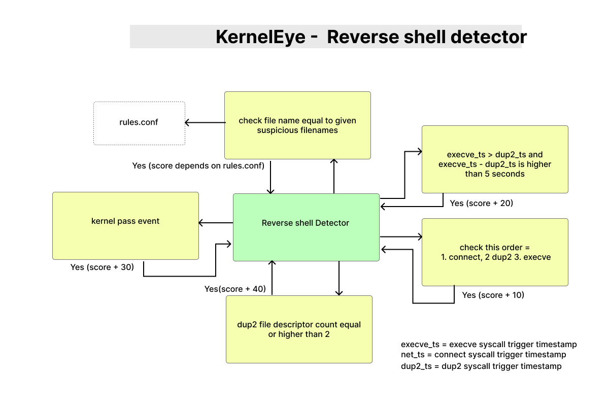

# KernelEye - Reverse Shell Detector

> This document describes the Reverse Shell detector in Kernel Eye.  
> It identifies reverse shell behavior using a combination of syscall correlation, timing analysis, and filename-based heuristics.

---



## 1. Overview

The Reverse Shell detector analyzes events that have already passed kernel-level correlation and determines whether they represent a real reverse shell attack.

It combines:

- syscall behavior (connect + dup2 + execve)  
- timing correlation  
- execution context (filename)  
- scoring system  

---

## 2. Detection Trigger

This detector only processes events of type:

```c id="rs_trigger"
KE_EVENT_REVERSE_SHELL
````

---

### Entry Condition

```c id="rs_entry"
if(event->hdr.type != KE_EVENT_REVERSE_SHELL) return 0;
```

---

## 3. Detection Strategy

The detector uses **two main correlation layers**:

```id="rs_layers"
1. Time-based correlation
2. Filename-based correlation
```

---

## 4. Time-Based Correlation

### Function:

```c id="rs_time_fn"
reverse_shell_time_correlation(...)
```

---

### Signals Used:

* `execve_ts` → execution timestamp
* `net_ts` → network connection timestamp
* `dup2_ts` → descriptor redirection timestamp
* `stdio_redirects` → number of redirects

---

### Logic

#### Base Signal

```id="rs_base"
connect + dup2 + execve → +30 score
```

---

#### Descriptor Check

```id="rs_dup2"
stdio_redirects >= 2 → +40 score
```

---

#### Timing Correlation

```id="rs_time"
execve - dup2 < 5 seconds → +20 score
```

---

#### Ordering Check

```id="rs_order"
connect → dup2 → execve → +10 score
```

---

### Insight

* Tight timing = strong signal
* Proper ordering = realistic attack flow

---

## 5. Filename-Based Correlation

### Function:

```c id="rs_file_fn"
reverse_shell_filename_correlation(...)
```

---

### Process:

1. Extract basename from path
2. Convert to lowercase
3. Match against rule set

---

### Example:

```id="rs_file_example"
"/bin/bash" → "bash"
```

---

### Rule Matching

Rules are loaded from:

```id="rs_rules_path"
detections/config/rules.conf
```

---

### Example Rules

```id="rs_rules"
bash:15
nc:25
python:10
curl:5
```

---

### Behavior

* If filename matches:

  * increase score
  * adjust severity

---

### Purpose

* Detect known reverse shell tools
* Prevent case-based bypass
* Add contextual confidence

---

## 6. Scoring System

### Maximum Score:

```id="rs_score_max"
100
```

---

### Score Composition

| Signal               | Score    |
| -------------------- | -------- |
| Syscall pattern      | +30      |
| Descriptor redirects | +40      |
| Timing correlation   | +20      |
| Correct ordering     | +10      |
| Filename rules       | variable |

---

### Score Normalization

```c id="rs_cap"
if (result->score > 100) result->score = 100;
```

---

## 7. Severity Assignment

Final severity is based on score:

```c id="rs_severity"
if(score >= BLOCK_SCORE) → CRITICAL
else if(score >= ALERT_SCORE) → WARNING
else → INFO
```

---

### Interpretation:

* **INFO** → weak signal
* **WARNING** → suspicious
* **CRITICAL** → strong reverse shell detection

---

## 8. Detection Result

If score > 0:

```c id="rs_detected"
result->detected = true;
```

---

### Output Includes:

* detection_id
* score
* severity
* detection flag

---

## 9. Example Detection Flow

```id="rs_flow"
connect → dup2 → execve("/bin/bash")
        ↓
kernel correlation → event generated
        ↓
Detection Engine
        ↓
Time correlation → +60
Filename match → +15
        ↓
Total score = 75
        ↓
Severity = CRITICAL
```

---

## 10. Design Strengths

* Multi-layer detection (not single signal)
* Combines behavior + context
* Resistant to simple bypasses
* Scoring-based (flexible)

---

## 11. Limitations

* Time-based detection can be bypassed with delays
* Filename-based detection depends on rule coverage
* No process tree tracking (fork/ppid gaps)

---

## 12. Evasion Considerations

Possible attacker techniques:

* introduce delays between syscalls
* use uncommon binaries
* fork child processes to break correlation
* use `dup3` or `fcntl` instead of `dup2`

---

## 13. Future Improvements

* PPID / process tree tracking
* Support for `dup3` and `fcntl`
* Adaptive timing windows
* Advanced behavioral scoring
* Multi-event correlation across processes

---

## 14. Design Philosophy

> **Strong detections come from combining weak signals.**

This detector avoids:

* single-event assumptions
* rigid rules

Instead, it uses:

* correlation
* scoring
* layered validation

---

## 15. Summary

The Reverse Shell detector transforms:

```id="rs_summary"
correlated syscall event → scored detection → actionable result
```

By combining timing, behavior, and context, it provides a **reliable and extensible detection mechanism**.
