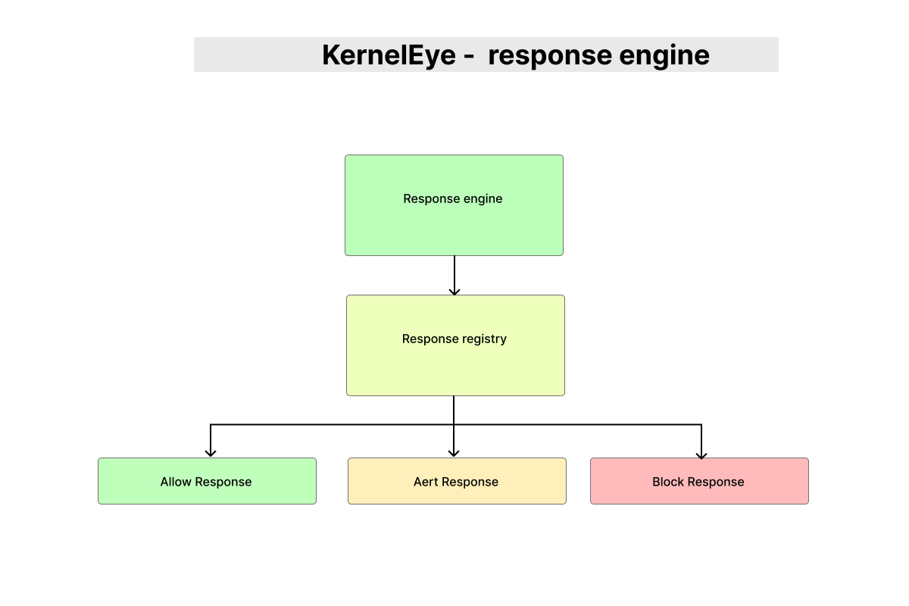

# KernelEye - Response Engine

> This document describes the Response Engine in Kernel Eye.  
> It is responsible for executing actions based on decisions made by the Policy Engine.

---



## 1. Overview

The Response Engine translates policy decisions into concrete actions such as:

- allowing execution  
- generating alerts  
- terminating malicious processes  

---

## 2. System Flow

``` id="re_flow1"
Detection Engine → Policy Engine → Response Engine → Action
````

---

## 3. Core Function

```c id="re_core"
int ke_execute_response(enum ke_policy_result action,
                        struct ke_event_header *event);
```

---

### Responsibilities:

* receive policy decision
* select matching response
* execute corresponding action

---

## 4. Execution Logic

```c id="re_logic"
for(int i = 0; i < response_count; i++) {
    if(responses[i]->action == action) {
        return responses[i]->execute(event);
    }
}
```

---

### Behavior:

* iterate through registered responses
* match based on `action`
* execute corresponding handler

---

## 5. Response Registry

```c id="re_registry"
ke_response *responses[] = {
    &allow_response,
    &alert_response,
    &block_response
};
```

---

### Purpose:

* centralize all response modules
* enable modular architecture
* support easy extension

---

### Response Count

```c id="re_count"
int response_count = sizeof(responses)/sizeof(responses[0]);
```

---

## 6. Response Structure

```c id="re_struct"
typedef struct {
    enum ke_policy_result action;
    int (*execute)(struct ke_event_header *event);
} ke_response;
```

---

### Fields:

* `action` → policy action type
* `execute` → function pointer to handler

---

## 7. Response Types

---

### 7.1 Allow Response

```c id="re_allow"
int allow_execute(struct ke_event_header *event){
    return 0;
}
```

---

#### Behavior:

* does nothing
* allows process to continue

---

### 7.2 Alert Response

```c id="re_alert"
int alert_execute(struct ke_event_header *event){
    // dispatch to event-specific printers
}
```

---

#### Dispatch Table

```c id="re_alert_table"
{ KE_EVENT_REVERSE_SHELL → print_reverse_shell }
```

---

#### Behavior:

* routes event to appropriate printer
* used for logging / monitoring
* does not interfere with execution

---

---

### 7.3 Block Response

```c id="re_block"
int block_execute(struct ke_event_header *event){
    kill(event->pid, SIGTERM);
    return 0;
}
```

---

#### Behavior:

* terminates malicious process
* active defense mechanism

---

## 8. Alert Dispatch Mechanism

The alert system uses a secondary dispatch layer:

```id="re_alert_flow"
event type → printer table → handler function
```

---

### Example:

```c id="re_alert_dispatch"
if(alert_printers[i].type == event->type){
    return alert_printers[i].printer(event);
}
```

---

### Benefits:

* event-specific formatting
* modular alert handling
* extensible per detection type

---

## 9. Example Flow

```id="re_example"
Detection Result → CRITICAL
        ↓
Policy Engine → BLOCK
        ↓
Response Engine
        ↓
block_execute()
        ↓
kill(pid)
```

---

## 10. Design Characteristics

### • Modular

* responses are independent modules
* no hardcoded logic in engine

---

### • Extensible

* new responses can be added easily
* registry-based system

---

### • Flexible

* supports multiple response types
* adaptable to different environments

---

## 11. Design Philosophy

> **Policy decides. Response executes.**

---

## 12. Advantages

* clean separation of concerns
* scalable architecture
* easy to maintain and extend
* supports multiple action types

---

## 13. Limitations

* blocking uses only `SIGTERM`
* no retry or fallback mechanism
* no logging for unknown event types
* alert system currently minimal

---

## 14. Future Improvements

* support for `SIGKILL` fallback
* structured logging system
* external alert integrations (SIEM, logs)
* response chaining (alert + block)
* configurable response policies
* rate-limited alerting

---

## 15. Role in System

```id="re_flow2"
event → detection → policy → response → system action
```

---

## 16. Summary

The Response Engine converts:

```id="re_summary"
policy decision → real-world action
```

It ensures Kernel Eye can:

* observe
* decide
* act

making it a **complete runtime security system**.
